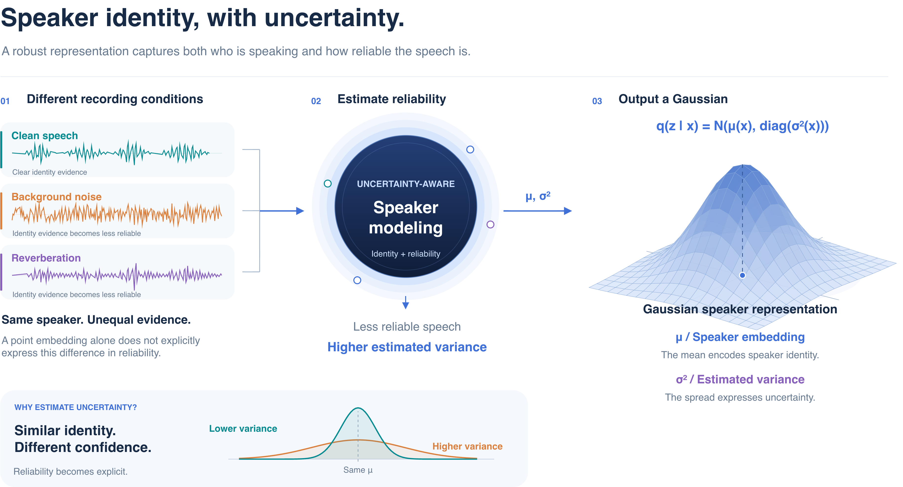

# WeSpeaker U³-xi

💡 WeSpeaker implementations for uncertainty-aware speaker recognition and verification, covering uncertainty estimation, speaker embedding learning, scoring, score normalization, and calibration.

**Keywords:** RecXi, NeurIPS 2023, speaker recognition, speaker verification, speaker embedding, WeSpeaker implementation, source code, ECAPA-TDNN, uncertainty estimation, uncertainty-aware speaker modeling.

[Core idea](#core-idea) · [Getting started](#getting-started) · [U³-xi](#u3-xi) · [Robust speaker modeling](#robust-speaker-modeling) · [Unified back-end](#unified-back-end) · [RecXi](examples/voxceleb/v2/readme_recxi.md) · [Citation](#citation)

## Core Idea



[Editable draw.io source](docs/figures/uncertainty-overview.drawio) · [Vector SVG](docs/figures/uncertainty-overview-drawio.svg)

The goal is to estimate higher uncertainty when speech provides less reliable speaker evidence, such as under noise or reverberation. Frame-level precision estimates guide Bayesian pooling so reliable frames contribute more to the utterance representation. The model outputs both a speaker embedding and its associated uncertainty.

*Conceptual illustration; the waveforms and distributions are schematic, not experimental measurements.*

## 📚 Papers and Implementations

- **[$\mathcal{U}^3$-xi: Pushing the Boundaries of Speaker Recognition by Incorporating Uncertainty](https://arxiv.org/abs/2601.15719)** — official implementation of multi-view uncertainty estimation, uncertainty-aware training, and uncertainty-aware cosine scoring.
- **[Towards Robust Uncertainty-Aware Speaker Modeling](https://arxiv.org/abs/2607.04937)** — official implementation of inter- and intra-speaker-aware uncertainty modeling with AAM-Softmax, AM-Softmax, and SphereFace2. The UCDA method described in the paper is not included in this release.
- **[A Unified Uncertainty-Aware Back-End for Speaker Verification: Scoring, Normalization, and Calibration](https://arxiv.org/abs/2609.01221)** — official implementation of uncertainty-aware cosine scoring, UAS-Norm, and UQMF calibration.
- **[Disentangling Voice and Content with Self-Supervision for Speaker Recognition](https://proceedings.neurips.cc/paper_files/paper/2023/hash/9d276b0a087efdd2404f3295b26c24c1-Abstract-Conference.html)** (**RecXi, NeurIPS 2023**) — an **unofficial implementation and extension** with parallel RecXi pooling, a multi-view Transformer precision estimator, and uncertainty-aware AAM-Softmax. See the [RecXi implementation, training recipe, and results](examples/voxceleb/v2/readme_recxi.md).

## Getting Started

This project builds on [WeSpeaker](https://github.com/wenet-e2e/wespeaker). Refer to the [original WeSpeaker README](README_wespeaker.md#installation) for environment setup and the [VoxCeleb recipe](examples/voxceleb/v2/README.md) for data preparation. Use the configurations and scripts in this repository for the uncertainty-aware experiments described below.

- **Main recipe:** [examples/voxceleb/v2/run.sh](examples/voxceleb/v2/run.sh)
- **Model configurations:** [examples/voxceleb/v2/conf](examples/voxceleb/v2/conf)
- **RecXi recipe:** [examples/voxceleb/v2/readme_recxi.md](examples/voxceleb/v2/readme_recxi.md)

Run recipe scripts from `examples/voxceleb/v2` after configuring the dataset paths, GPU IDs, and experiment directory for your environment.

<a id="u3-xi"></a>

## 1. $\mathcal{U}^3$-xi: Pushing the Boundaries of Speaker Recognition by Incorporating Uncertainty

<p align="center">
  <b>Junjie Li</b>, Kong Aik Lee <br>
  <i>The Hong Kong Polytechnic University</i>
</p>

<p align="center">
  <a href="https://arxiv.org/abs/2601.15719">
    
  </a>
  <a href="https://huggingface.co/JeffeLI/u_cube_xi">
    
  </a>
  
  
</p>
<p align="center">
  Email: <a href="mailto:junjie98.li@connect.polyu.hk">junjie98.li@connect.polyu.hk</a>
</p>

### Key Highlights

U³-xi incorporates uncertainty into speaker embedding learning and verification. The implementation provides:

- **Multi-view uncertainty estimation:** a multi-view self-attention (MVA) module estimates the uncertainty of frame-level representations.
- **Global uncertainty supervision:** predicted uncertainty adjusts the softmax scale during training.
- **Uncertainty-aware cosine scoring:** embedding uncertainty is incorporated into verification scores.

### Experiments

Training and evaluation recipes are available in [examples/voxceleb/v2](examples/voxceleb/v2). The main implementation entry points are listed below.

- **Configurations**
    - [ecapa_tdnn_u_cube.yaml](examples/voxceleb/v2/conf/ecapa_tdnn_u_cube.yaml)
    - [resnet_u_cube.yaml](examples/voxceleb/v2/conf/resnet_u_cube.yaml)
    - [redimnet_u_cube.yaml](examples/voxceleb/v2/conf/redimnet_u_cube.yaml)
- **Models**
    - [ECAPA-TDNN](wespeaker/models/ecapa_tdnn.py#L230-L244)
    - [ResNet](wespeaker/models/resnet.py#L195)
    - [ReDimNet](wespeaker/models/redimnet.py#L863)
- **Pooling layer:** [U_Cube_XI](wespeaker/models/pooling_layers.py#L424)
    - **Multi-view self-attention:** [MVA](wespeaker/models/MHA.py)
- **Projection layer:** [ArcMarginProduct_uncertainty](wespeaker/models/projections.py#L410)
- **Training executor:** [executor.py](wespeaker/utils/executor.py)
- **Training script:** [train.py](wespeaker/bin/train.py#L153). TorchScript compilation is disabled in this recipe because the MVA module is not compatible with it.

### Results

The table reports equal error rate (EER, %) on the cleaned VoxCeleb1-O, VoxCeleb1-E, and VoxCeleb1-H trial lists. Lower values are better. **LM** denotes large-margin fine-tuning, **AS-Norm** denotes adaptive score normalization, and **QMF** denotes quality measure function calibration. ✓ and × indicate whether a component is enabled; rows with a blank model name use the model listed above; blank FLOPs values for named models were not reported.

| Model | Parameters | FLOPs | LM | AS-Norm | QMF | Vox1-O-clean | Vox1-E-clean | Vox1-H-clean |
|:------|:------:|:------|:--:|:-------:|:---:|:------------:|:------------:|:------------:|
| ECAPA_TDNN_GLOB_c512-ASTP-emb192  | 6.19M | 1.04G | × | × | × | 1.069 | 1.209 | 2.310 |
|                                   |       |       | × | ✓ | × | 0.957 | 1.128 | 2.105 |
|                                   |       |       | ✓ | × | × | 0.878 | 1.072 | 2.007 |
|                                   |       |       | ✓ | ✓ | × | 0.782 | 1.005 | 1.824 |
| ECAPA_TDNN_GLOB_c1024-ASTP-emb192 | 14.65M | 2.65G | × | × | × | 0.856 | 1.072 | 2.059 |
|                                   |        |       | × | ✓ | × | 0.808 | 0.990 | 1.874 |
|                                   |        |       | ✓ | × | × | 0.798 | 0.993 | 1.883 |
|                                   |        |       | ✓ | ✓ | × | 0.728 | 0.929 | 1.721 |
|                                   |        |       | ✓ | ✓ | ✓ | 0.707 | 0.894 | 1.615 |
| ResNet34-TSTP-emb256 | 6.63M | 4.55G | × | × | × | 0.867 | 1.049 | 1.959 |
|                      |       |       | × | ✓ | × | 0.787 | 0.964 | 1.726 |
|                      |       |       | × | ✓ | ✓ | 0.718 | 0.911 | 1.606 |
|                      |       |       | ✓ | × | × | 0.797 | 0.937 | 1.695 |
|                      |       |       | ✓ | ✓ | × | 0.723 | 0.867 | 1.532 |
|                      |       |       | ✓ | ✓ | ✓ | 0.659 | 0.821 | 1.437 |
| XI_VEC_ECAPA_TDNN_c512       | 5.9M | 1.04G      | × | × | × | 0.995 | 1.130 | 2.169 |
|                  |       |       | × | ✓ | × | 0.883 | 1.056 | 1.976 |
|                  |       |       | ✓ | × | × | 0.909 | 1.000 | 1.855 |
|                  |       |       | ✓ | ✓ | × | 0.787 | 0.930 | 1.693 |
| **ECAPA_TDNN_c512_u_cube_xi(ours)**| 6.7M | 1.20G      | × | × | × | 0.782 | 1.016 | 1.888 |
| **ResNet34_u_cube_xi(ours)**       | 7.9M |            | × | × | × | 0.867 | 0.868 | 1.641 |
| **ReDimNet-B2(ours)**              | 5.5M |            | × | × | × | 0.606 | 0.779 | 1.494 |
|                                    |      |            | ✓ | × | × | 0.489 | 0.698 | 1.311 |
|                                    |      |            | ✓ | ✓ | × | 0.399 | 0.638 | 1.170 |

### Pretrained Models

These checkpoints were retrained, so their results may differ slightly from those reported in the paper.

- [Voxceleb2_ECAPA-TDNN-512_u_cube](https://drive.google.com/file/d/1bMqisoKLM4eKkCAW7k7Ya-M3tNERQVh0/view?usp=drive_link)
- [Voxceleb2_ResNet34_u_cube](https://drive.google.com/file/d/1Lf2CnB6ReIMyq7w06ucORmMF41GzdH76/view?usp=drive_link)
- [Voxceleb2_ReDimNet-B2_u_cube](https://drive.google.com/file/d/1S2pWyI3HIRGgdTh686J08oAWK3UmqAT-/view?usp=drive_link)
- [Voxceleb2_Xi-ECAPA-TDNN-512](https://drive.google.com/file/d/1Aw1qPe_oQkjDnFjYunCq5-KXIga3J1r6/view?usp=sharing)

<a id="robust-speaker-modeling"></a>

## 2. Towards Robust Uncertainty-Aware Speaker Modeling

<p align="center">
  <a href="https://arxiv.org/abs/2607.04937">
    
  </a>
</p>

This work addresses uncertainty estimation and calibration under domain shifts through two methods:

- **Inter- and Intra-Speaker-Aware Uncertainty Softmax:** incorporates inter-speaker separability and intra-speaker variability into uncertainty learning.
- **Uncertainty-Calibrated Domain Adaptation (UCDA):** addresses uncertainty miscalibration caused by domain mismatch.

> **Implementation scope:** This release includes Inter- and Intra-Speaker-Aware Uncertainty Softmax only. UCDA is described in the paper but is not included in this repository.

### Implementations

- **UAAM-Softmax inter-intra:** [ArcMarginProduct_uncertainty_inter_intra](wespeaker/models/projections.py#L506)
- **USphereFace2 inter-intra:** [SphereFace2_uncertainty_Arcguide_inter_intra](wespeaker/models/projections.py#L199)
- **UAM-Softmax inter-intra:** [AddMarginProduct_uncertainty_inter_intra](wespeaker/models/projections.py#L835)

> **Training note:** [train.py](wespeaker/bin/train.py#L231-L242) supports alpha scheduling for USphereFace2 inter-intra.

### Results

The table reports EER (%) and minimum detection cost function (minDCF) values for in-domain evaluation on VoxCeleb1 and cross-domain evaluation on CNCeleb. Lower values are better. RI denotes relative improvement over the corresponding benchmark, and links in the loss column point to model checkpoints.

<table style="border-collapse: collapse; border-top: 3px solid #000; border-bottom: 3px solid #000;">
  <thead>
    <tr>
      <th rowspan="3">Model</th>
      <th rowspan="3"># Param.</th>
      <th rowspan="3">Loss</th>
      <th rowspan="3">Uncertainty-aware cosine score</th>
      <th colspan="7">In-domain</th>
      <th colspan="3">Cross-domain</th>
    </tr>
    <tr>
      <th colspan="2">Vox1-O</th>
      <th colspan="2">Vox1-E</th>
      <th colspan="2">Vox1-H</th>
      <th rowspan="2">RI (%)</th>
      <th colspan="2">CNCeleb</th>
      <th rowspan="2">RI (%)</th>
    </tr>
    <tr>
      <th>EER</th>
      <th>minDCF</th>
      <th>EER</th>
      <th>minDCF</th>
      <th>EER</th>
      <th>minDCF</th>
      <th>EER</th>
      <th>minDCF</th>
    </tr>
  </thead>
  <tbody>
    <tr style="border-top: 6px double #000;"><td rowspan="11">ECAPA512</td><td>6.19 M</td><td>AAM-Softmax</td><td>No</td><td>1.069</td><td>0.122</td><td>1.209</td><td>0.136</td><td>2.310</td><td>0.226</td><td>Benchmark</td><td>15.314</td><td>0.633</td><td>Benchmark</td></tr>
    <tr style="border-top: 3px solid #000;"><td rowspan="2">6.69 M</td><td rowspan="2">UAAM-Softmax</td><td>No</td><td>0.856</td><td>0.109</td><td>1.064</td><td>0.121</td><td>1.982</td><td>0.195</td><td>13.57</td><td>13.706</td><td>0.608</td><td>7.23</td></tr>
    <tr style="border-top: 3px solid #000;"><td>Yes</td><td>0.782</td><td>0.100</td><td>1.016</td><td>0.115</td><td>1.888</td><td>0.187</td><td>18.64</td><td>10.271</td><td>1.000</td><td>-12.52</td></tr>
    <tr style="border-top: 3px solid #000;"><td rowspan="2">6.69</td><td rowspan="2"><a href="https://drive.google.com/drive/folders/1PcI8UM5blXePt2ZCnyNycnj0co5a2XLa?usp=sharing">UAAM-Softmax inter-intra</a></td><td>No</td><td>0.936</td><td>0.102</td><td>1.050</td><td>0.122</td><td>1.978</td><td>0.195</td><td>13.40</td><td>13.974</td><td>0.581</td><td>8.48</td></tr>
    <tr style="border-top: 3px solid #000;"><td>Yes</td><td>0.840</td><td>0.086</td><td><strong>0.965</strong></td><td>0.110</td><td>1.833</td><td>0.189</td><td><strong>21.22</strong></td><td>10.781</td><td>0.835</td><td>-1.16</td></tr>
    <tr style="border-top: 3px solid #000;"><td>6.19 M</td><td>AM-Softmax</td><td>No</td><td>1.005</td><td>0.107</td><td>1.206</td><td>0.133</td><td>2.254</td><td>0.221</td><td>Benchmark</td><td>14.162</td><td>0.611</td><td>Benchmark</td></tr>
    <tr style="border-top: 3px solid #000;"><td rowspan="2">6.69 M</td><td rowspan="2"><a href="https://drive.google.com/drive/folders/1t9SOt2XlNk4RGV8Q5TfEjZb2iUltIWJl?usp=sharing">UAM-Softmax inter-intra</a></td><td>No</td><td>0.888</td><td>0.099</td><td>1.076</td><td>0.119</td><td>1.973</td><td>0.186</td><td>11.46</td><td>12.436</td><td>0.553</td><td><strong>10.84</strong></td></tr>
    <tr style="border-top: 3px solid #000;"><td>Yes</td><td>0.808</td><td><strong>0.084</strong></td><td>0.991</td><td>0.109</td><td>1.794</td><td><strong>0.178</strong></td><td>19.46</td><td><strong>9.411</strong></td><td>1.000</td><td>-15.03</td></tr>
    <tr style="border-top: 3px solid #000;"><td>6.19 M</td><td>SphereFace2</td><td>No</td><td>0.963</td><td>0.108</td><td>1.121</td><td>0.125</td><td>1.967</td><td>0.199</td><td>Benchmark</td><td>12.582</td><td>0.573</td><td>Benchmark</td></tr>
    <tr style="border-top: 3px solid #000;"><td rowspan="2">6.69 M</td><td rowspan="2"><a href="https://drive.google.com/drive/folders/1Luy6GQ7OBWhdbfTkLcgSN7QV4bz2dl0W?usp=sharing">USphereFace2 inter-intra</a></td><td>No</td><td>0.856</td><td>0.104</td><td>1.035</td><td>0.119</td><td>1.918</td><td>0.196</td><td>5.21</td><td>12.265</td><td><strong>0.550</strong></td><td>3.27</td></tr>
    <tr style="border-top: 3px solid #000;"><td>Yes</td><td><strong>0.739</strong></td><td>0.102</td><td><strong>0.965</strong></td><td><strong>0.108</strong></td><td><strong>1.771</strong></td><td><strong>0.178</strong></td><td>12.81</td><td>10.560</td><td>0.624</td><td>3.59</td></tr>
    <tr style="border-top: 6px double #000;"><td rowspan="7">ResNet34</td><td>6.63 M</td><td>AAM-Softmax</td><td>No</td><td>0.867</td><td>0.091</td><td>1.049</td><td>0.121</td><td>1.960</td><td>0.192</td><td>Benchmark</td><td>11.090</td><td><strong>0.488</strong></td><td>Benchmark</td></tr>
    <tr style="border-top: 3px solid #000;"><td rowspan="2">7.92 M</td><td rowspan="2">UAAM-Softmax</td><td>No</td><td>0.888</td><td>0.085</td><td>0.900</td><td>0.099</td><td>1.712</td><td>0.175</td><td>9.68</td><td>11.732</td><td>0.513</td><td>-5.46</td></tr>
    <tr style="border-top: 3px solid #000;"><td>Yes</td><td>0.867</td><td>0.078</td><td>0.868</td><td>0.095</td><td>1.641</td><td>0.172</td><td>13.29</td><td>10.082</td><td>0.541</td><td>-0.89</td></tr>
    <tr style="border-top: 3px solid #000;"><td rowspan="2">7.92 M</td><td rowspan="2"><a href="https://drive.google.com/drive/folders/1c9ohIlh6re-R4MdqW3x2wGb6nGvyq6Au?usp=sharing">UAAM-Softmax inter-intra</a></td><td>No</td><td>0.904</td><td><strong>0.070</strong></td><td>0.933</td><td>0.098</td><td>1.658</td><td><strong>0.165</strong></td><td>13.06</td><td>12.116</td><td>0.505</td><td>-6.37</td></tr>
    <tr style="border-top: 3px solid #000;"><td>Yes</td><td><strong>0.813</strong></td><td>0.075</td><td><strong>0.847</strong></td><td><strong>0.091</strong></td><td><strong>1.532</strong></td><td>0.167</td><td><strong>17.12</strong></td><td><strong>9.631</strong></td><td>0.539</td><td><strong>1.35</strong></td></tr>
    <tr style="border-top: 3px solid #000;"><td rowspan="2">7.92 M</td><td rowspan="2">USphereFace2</td><td>No</td><td>1.483</td><td>0.148</td><td>1.451</td><td>0.156</td><td>2.112</td><td>0.206</td><td>-36.00</td><td>11.441</td><td>0.512</td><td>-4.04</td></tr>
    <tr style="border-top: 3px solid #000;"><td>Yes</td><td>1.340</td><td>0.156</td><td>1.357</td><td>0.150</td><td>1.986</td><td>0.193</td><td>-30.19</td><td>10.949</td><td>0.499</td><td>-0.49</td></tr>
    <tr style="border-top: 6px double #000;"><td rowspan="7">ReDimNet-B2</td><td>4.89 M</td><td>AAM-Softmax</td><td>No</td><td>0.782</td><td>0.064</td><td>0.907</td><td>0.097</td><td>1.667</td><td>0.162</td><td>Benchmark</td><td>12.385</td><td>0.552</td><td>Benchmark</td></tr>
    <tr style="border-top: 3px solid #000;"><td rowspan="2">5.46 M</td><td rowspan="2">UAAM-Softmax</td><td>No</td><td>0.649</td><td>0.073</td><td>0.801</td><td>0.089</td><td>1.532</td><td>0.153</td><td>6.09</td><td>13.464</td><td>0.552</td><td>-4.36</td></tr>
    <tr style="border-top: 3px solid #000;"><td>Yes</td><td><strong>0.606</strong></td><td>0.065</td><td>0.779</td><td>0.091</td><td>1.494</td><td>0.157</td><td>9.12</td><td>9.479</td><td>1.000</td><td>-28.85</td></tr>
    <tr style="border-top: 3px solid #000;"><td rowspan="2">5.46 M</td><td rowspan="2"><a href="https://drive.google.com/drive/folders/1vROZR5yv-CG897qEguFXR9xRBvZjQ590?usp=sharing">UAAM-Softmax inter-intra</a></td><td>No</td><td>0.686</td><td>0.070</td><td>0.802</td><td>0.090</td><td>1.536</td><td>0.151</td><td>6.06</td><td>12.132</td><td>0.516</td><td>4.28</td></tr>
    <tr style="border-top: 3px solid #000;"><td>Yes</td><td>0.627</td><td>0.064</td><td><strong>0.758</strong></td><td>0.088</td><td>1.434</td><td>0.153</td><td>10.84</td><td><strong>8.607</strong></td><td>0.838</td><td>-10.65</td></tr>
    <tr style="border-top: 3px solid #000;"><td rowspan="2">5.46 M</td><td rowspan="2"><a href="https://drive.google.com/drive/folders/17CKqWU2bq4ugsNpFU2DYxCgbh1te5ikT?usp=sharing">USphereFace2 inter-intra</a></td><td>No</td><td>0.622</td><td>0.052</td><td>0.776</td><td>0.085</td><td>1.440</td><td>0.146</td><td>14.92</td><td>12.081</td><td>0.515</td><td>4.58</td></tr>
    <tr style="border-top: 3px solid #000;"><td>Yes</td><td>0.622</td><td><strong>0.051</strong></td><td>0.774</td><td><strong>0.084</strong></td><td><strong>1.433</strong></td><td><strong>0.145</strong></td><td><strong>15.56</strong></td><td>11.899</td><td><strong>0.506</strong></td><td><strong>6.13</strong></td></tr>
  </tbody>
</table>

<a id="unified-back-end"></a>

## 3. A Unified Uncertainty-Aware Back-End for Speaker Verification: Scoring, Normalization, and Calibration

<p align="center">
  <a href="https://arxiv.org/abs/2609.01221">
    
  </a>
</p>

This work carries embedding uncertainty through the speaker verification back-end, from similarity scoring to normalization and calibration. Each utterance is represented by a speaker embedding and its covariance estimate.

The unified pipeline includes three components:

- **Uncertainty-aware cosine scoring:** adjusts similarity scoring using embedding uncertainty.
- **Uncertainty-aware AS-Norm (UAS-Norm):** incorporates uncertainty into score normalization.
- **Uncertainty-aware quality measure function calibration (UQMF):** uses uncertainty-related features for score calibration.

### Experiments

The [VoxCeleb recipe](examples/voxceleb/v2/run.sh) includes uncertainty extraction, scoring, normalization, and calibration. The corresponding scripts are listed in pipeline order below.

- **Uncertainty extraction**
  - [local/extract_vox_uncertainty.sh](examples/voxceleb/v2/local/extract_vox_uncertainty.sh)
  - [tools/extract_embedding_uncertainty.sh](tools/extract_embedding_uncertainty.sh)
  - [wespeaker/bin/extract_uncertainty.py](wespeaker/bin/extract_uncertainty.py)

- **Uncertainty-aware cosine scoring**
  - [local/score_uncertainty.sh](examples/voxceleb/v2/local/score_uncertainty.sh)
  - [wespeaker/bin/score_uncertainty.py](wespeaker/bin/score_uncertainty.py)

- **Uncertainty-aware AS-Norm (UAS-Norm)**
  - [local/score_norm_uncertainty.sh](examples/voxceleb/v2/local/score_norm_uncertainty.sh)
  - [tools/variance_mean.py](tools/variance_mean.py)
  - [wespeaker/bin/score_norm_uncertainty.py](wespeaker/bin/score_norm_uncertainty.py)

- **Uncertainty-aware calibration (UQMF)**
  - [local/score_calibration_uncertainty.sh](examples/voxceleb/v2/local/score_calibration_uncertainty.sh)
  - [wespeaker/bin/score_norm_forvox2.py](wespeaker/bin/score_norm_forvox2.py)
  - [wespeaker/bin/score_calibration_uncertain.py](wespeaker/bin/score_calibration_uncertain.py)

### Results

The table reports EER (%) and minDCF on Vox1-O, Vox1-E, and Vox1-H. Lower values are better. **Bold** and <u>underlined</u> values denote the best and second-best results, respectively, within each architecture group. RI is the average relative improvement over the corresponding architecture-specific benchmark across the six VoxCeleb metrics. The suffixes `-o` and `-u` denote the original and uncertainty-aware variants, respectively; ①–③ identify the UAS-Norm components evaluated in the paper.

<table style="border-collapse: collapse; border-top: 3px solid #000; border-bottom: 3px solid #000;">
  <thead>
    <tr>
      <th rowspan="2">Row</th>
      <th rowspan="2">Model</th>
      <th rowspan="2"># Param.</th>
      <th rowspan="2">Cosine score</th>
      <th rowspan="2">AS-Norm</th>
      <th rowspan="2">QMFs</th>
      <th colspan="2">Vox1-O</th>
      <th colspan="2">Vox1-E</th>
      <th colspan="2">Vox1-H</th>
      <th rowspan="2">RI (%)</th>
    </tr>
    <tr>
      <th>EER</th>
      <th>minDCF</th>
      <th>EER</th>
      <th>minDCF</th>
      <th>EER</th>
      <th>minDCF</th>
    </tr>
  </thead>
  <tbody>
    <tr style="color: #777;"><td>1</td><td>ECAPA<sup>†</sup></td><td>6.19 M</td><td><i>s</i><sub>cos-o</sub></td><td></td><td></td><td>1.069</td><td>0.122</td><td>1.209</td><td>0.136</td><td>2.310</td><td>0.226</td><td>Benchmark</td></tr>
    <tr style="border-top: 3px solid #000;"><td>2</td><td rowspan="8">ECAPA+xi</td><td rowspan="8">6.69 M</td><td><i>s</i><sub>cos-o</sub></td><td></td><td></td><td>0.936</td><td>0.100</td><td>1.054</td><td>0.123</td><td>1.978</td><td>0.195</td><td>13.49</td></tr>
    <tr><td>3</td><td><i>s</i><sub>cos-o</sub></td><td><i>s</i><sub>AS-o</sub></td><td></td><td>0.840</td><td>0.111</td><td>0.979</td><td>0.115</td><td>1.809</td><td>0.173</td><td>18.34</td></tr>
    <tr><td>4</td><td><i>s</i><sub>cos-o</sub></td><td><i>s</i><sub>AS-o</sub></td><td><i>s</i><sub>QMF-o</sub></td><td><u>0.766</u></td><td>0.106</td><td><u>0.932</u></td><td>0.108</td><td><u>1.693</u></td><td><u>0.167</u></td><td>22.96</td></tr>
    <tr style="border-top: 3px solid #000;"><td>5</td><td><i>s</i><sub>cos-u</sub></td><td></td><td></td><td>0.840</td><td><b>0.086</b></td><td>0.965</td><td>0.110</td><td>1.833</td><td>0.189</td><td>21.21</td></tr>
    <tr><td>6</td><td><i>s</i><sub>cos-u</sub></td><td><i>s</i><sub>AS-u</sub> (①)</td><td></td><td>0.761</td><td>0.101</td><td>0.913</td><td>0.104</td><td>1.677</td><td>0.167</td><td>24.59</td></tr>
    <tr><td>7</td><td><i>s</i><sub>cos-u</sub></td><td><i>s</i><sub>AS-u</sub> (①+②)</td><td></td><td>0.761</td><td>0.100</td><td>0.912</td><td>0.104</td><td>1.675</td><td><b>0.166</b></td><td>24.83</td></tr>
    <tr><td>8</td><td><i>s</i><sub>cos-u</sub></td><td><i>s</i><sub>AS-u</sub> (①+②+③)</td><td></td><td><b>0.750</b></td><td>0.098</td><td>0.906</td><td>0.100</td><td>1.663</td><td>0.167</td><td>25.86</td></tr>
    <tr><td>9</td><td><i>s</i><sub>cos-u</sub></td><td><i>s</i><sub>AS-u</sub></td><td><i>s</i><sub>QMF-u</sub></td><td><b>0.750</b></td><td><u>0.095</u></td><td><b>0.892</b></td><td><b>0.090</b></td><td><b>1.629</b></td><td><b>0.166</b></td><td>28.01</td></tr>
    <tr style="border-top: 6px double #000; color: #777;"><td>10</td><td>ResNet<sup>†</sup></td><td>6.63 M</td><td><i>s</i><sub>cos-o</sub></td><td></td><td></td><td>0.867</td><td>0.091</td><td>1.049</td><td>0.121</td><td>1.960</td><td>0.192</td><td>Benchmark</td></tr>
    <tr style="border-top: 3px solid #000;"><td>11</td><td rowspan="6">ResNet+xi</td><td rowspan="6">7.92 M</td><td><i>s</i><sub>cos-o</sub></td><td></td><td></td><td>0.904</td><td>0.070</td><td>0.933</td><td>0.098</td><td>1.658</td><td>0.165</td><td>13.06</td></tr>
    <tr><td>12</td><td><i>s</i><sub>cos-o</sub></td><td><i>s</i><sub>AS-o</sub></td><td></td><td>0.888</td><td>0.079</td><td>0.922</td><td>0.096</td><td>1.618</td><td>0.163</td><td>12.68</td></tr>
    <tr><td>13</td><td><i>s</i><sub>cos-o</sub></td><td><i>s</i><sub>AS-o</sub></td><td><i>s</i><sub>QMF-o</sub></td><td>0.782</td><td>0.065</td><td>0.842</td><td><u>0.090</u></td><td>1.489</td><td><u>0.151</u></td><td>21.52</td></tr>
    <tr style="border-top: 3px solid #000;"><td>14</td><td><i>s</i><sub>cos-u</sub></td><td></td><td></td><td>0.813</td><td>0.075</td><td>0.847</td><td>0.091</td><td>1.532</td><td>0.167</td><td>17.12</td></tr>
    <tr><td>15</td><td><i>s</i><sub>cos-u</sub></td><td><i>s</i><sub>AS-u</sub></td><td></td><td><u>0.771</u></td><td><b>0.052</b></td><td><u>0.805</u></td><td><b>0.086</b></td><td><u>1.400</u></td><td><b>0.145</b></td><td>26.53</td></tr>
    <tr><td>16</td><td><i>s</i><sub>cos-u</sub></td><td><i>s</i><sub>AS-u</sub></td><td><i>s</i><sub>QMF-u</sub></td><td><b>0.745</b></td><td><u>0.053</u></td><td><b>0.793</b></td><td><b>0.086</b></td><td><b>1.386</b></td><td><b>0.145</b></td><td>27.15</td></tr>
  </tbody>
</table>

<sup>†</sup> Results obtained directly from pretrained WeSpeaker models.

## Citation

If you use this repository in your research, please cite the papers relevant to the methods you use. BibTeX entries are provided below; select an IEEE bibliography style in your manuscript if required.

- **XI+:** uncertainty supervision for robust speaker embeddings.
- **[U³-xi](https://arxiv.org/abs/2601.15719):** multi-view uncertainty estimation and uncertainty-aware speaker modeling.
- **[Towards Robust Uncertainty-Aware Speaker Modeling](https://arxiv.org/abs/2607.04937):** inter- and intra-speaker-aware uncertainty learning.
- **[A Unified Uncertainty-Aware Back-End](https://arxiv.org/abs/2609.01221):** uncertainty-aware scoring, normalization, and calibration.

```bibtex
@inproceedings{li2026xiplus,
  author    = {Junjie Li and Kong Aik Lee and Duc-Tuan Truong and Tianchi Liu and Man-Wai Mak},
  title     = {{XI+}: Uncertainty Supervision for Robust Speaker Embedding},
  booktitle = {2026 IEEE International Conference on Acoustics, Speech and Signal Processing (ICASSP)},
  year      = {2026},
  pages     = {18847--18851},
  doi       = {10.1109/ICASSP55912.2026.11463369}
}

@article{li2026u3xi,
  author  = {Junjie Li and Kong Aik Lee},
  title   = {{U3}-xi: Pushing the Boundaries of Speaker Recognition by Incorporating Uncertainty},
  journal = {arXiv preprint arXiv:2601.15719},
  year    = {2026},
  doi     = {10.48550/arXiv.2601.15719},
  url     = {https://arxiv.org/abs/2601.15719}
}

@article{li2026robust,
  author  = {Junjie Li and Yang Xiao and Kong Aik Lee},
  title   = {Towards Robust Uncertainty-Aware Speaker Modeling},
  journal = {arXiv preprint arXiv:2607.04937},
  year    = {2026},
  doi     = {10.48550/arXiv.2607.04937},
  url     = {https://arxiv.org/abs/2607.04937}
}

@article{li2026unified,
  author  = {Junjie Li and Kong Aik Lee},
  title   = {A Unified Uncertainty-Aware Back-End for Speaker Verification: Scoring, Normalization, and Calibration},
  journal = {arXiv preprint arXiv:2609.01221},
  year    = {2026},
  doi     = {10.48550/arXiv.2609.01221},
  url     = {https://arxiv.org/abs/2609.01221}
}
```

If you use the RecXi implementation, please also cite the [original RecXi paper](https://proceedings.neurips.cc/paper_files/paper/2023/hash/9d276b0a087efdd2404f3295b26c24c1-Abstract-Conference.html):

```bibtex
@inproceedings{liu2023disentangling,
  author    = {Tianchi Liu and Kong Aik Lee and Qiongqiong Wang and Haizhou Li},
  title     = {Disentangling Voice and Content with Self-Supervision for Speaker Recognition},
  booktitle = {Advances in Neural Information Processing Systems},
  volume    = {36},
  year      = {2023},
  url       = {https://proceedings.neurips.cc/paper_files/paper/2023/hash/9d276b0a087efdd2404f3295b26c24c1-Abstract-Conference.html}
}
```

Please also acknowledge the underlying toolkit using the [WeSpeaker citations](README_wespeaker.md#citations).
