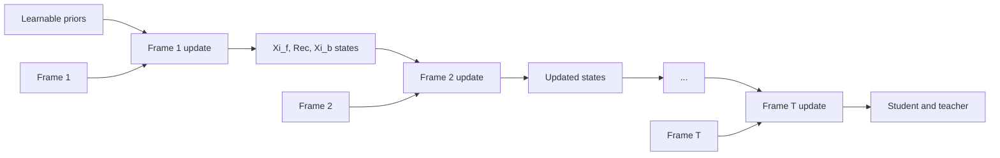
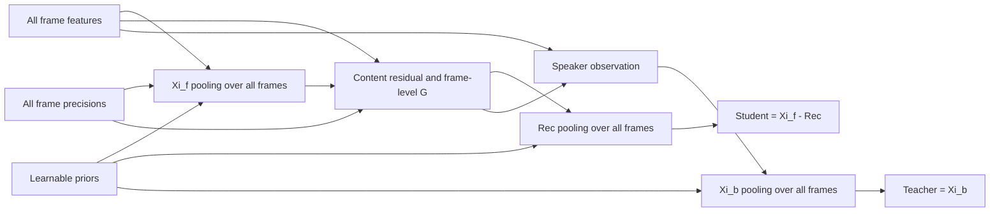

# RecXi for WeSpeaker

This recipe implements an efficient uncertainty-aware RecXi speaker embedding model in WeSpeaker. It builds on the speaker/content disentanglement introduced by the original RecXi [[2]](#ref-2).

## Differences from the original RecXi

The current implementation retains the RecXi speaker/content disentanglement and teacher–student learning objective, while introducing three main changes.

### 1. Parallel RecXi pooling

The original RecXi [[2]](#ref-2) computes its pooling stages serially. The current implementation reorganizes RecXi pooling into a parallel formulation to improve computational efficiency while preserving the speaker/content decomposition:

```text
student = Xi_f - Rec
teacher = Xi_b
```

The implementation is available in [`RecXiParallel`](../../../wespeaker/models/ecapa_recxi.py).

The following diagram illustrates the main computational difference. The original RecXi updates its posterior states frame by frame, so frame `t+1` depends on the states produced at frame `t`:



The current implementation performs each Bayesian pooling operation over all frames in parallel. `Xi_f`, `Rec`, and `Xi_b` still form a dependent decomposition, but there is no recurrent Python loop over the time axis:



In short:

```text
Original: frame 1 -> frame 2 -> ... -> frame T
Current:  all T frames -> vectorized Bayesian pooling
```

Here, “parallel” means parallelization across frames inside each pooling stage; it does not mean that the dependent `Xi_f`, `Rec`, and `Xi_b` stages are evaluated independently.

### 2. Multi-view Transformer precision estimator

The original RecXi uses the precision-estimation structure introduced by Xi-vector [[1]](#ref-1), which consists of two learnable linear layers.

The current implementation replaces it with the multi-view Transformer precision estimator proposed in U3-xi [[3]](#ref-3). It uses multiple attention views to estimate frame- and channel-dependent precision from both local and long-range contexts.

### 3. Uncertainty-aware AAM-Softmax

The original RecXi [[2]](#ref-2) is trained with AAM-Softmax.

The current implementation uses uncertainty-aware AAM-Softmax (UAAM-Softmax) [[4]](#ref-4). In addition to the speaker embedding, the model propagates a diagonal covariance to the embedding space. The classification objective uses this uncertainty when producing the training logits.

## Model overview

```text
80-dimensional fbank
  -> ECAPA-TDNN c512
  -> frame representation
  -> multi-view Transformer precision estimator
  -> parallel RecXi pooling
  -> speaker embedding and diagonal covariance
  -> UAAM-Softmax
```

During training, the model returns:

```text
(frame_feature, variance, embedding, teacher, student)
```

During inference, it returns:

```text
(frame_feature, variance, embedding)
```

The training objective is:

```text
loss = classification_loss + 3000 * SPKD(teacher, student)
```

RecXi has a dedicated [`trainer`](../../../wespeaker/bin/train_recxi.py) and [`executor`](../../../wespeaker/utils/executor_recxi.py), so its five-output interface and SPKD objective do not affect other WeSpeaker models.

## Files

- Model: [`wespeaker/models/ecapa_recxi.py`](../../../wespeaker/models/ecapa_recxi.py)
- SPKD loss: [`wespeaker/models/spkd_loss.py`](../../../wespeaker/models/spkd_loss.py)
- Trainer: [`wespeaker/bin/train_recxi.py`](../../../wespeaker/bin/train_recxi.py)
- Executor: [`wespeaker/utils/executor_recxi.py`](../../../wespeaker/utils/executor_recxi.py)
- Configuration: [`conf/ecapa_tdnn_recxi.yaml`](conf/ecapa_tdnn_recxi.yaml)
- Recipe: [`run_recxi.sh`](run_recxi.sh)

## Running the recipe

Run the following commands from `examples/voxceleb/v2`.

### Data preparation

```bash
bash run_recxi.sh --stage 1 --stop-stage 2
```

### Training

The example below uses physical GPUs 2 and 3. After setting `CUDA_VISIBLE_DEVICES=2,3`, they are exposed to the process as logical GPUs 0 and 1.

```bash
CUDA_VISIBLE_DEVICES=2,3 bash run_recxi.sh \
  --stage 3 \
  --stop-stage 3 \
  --gpus "[0,1]" \
  --config conf/ecapa_tdnn_recxi.yaml \
  --exp_dir exp/ECAPA_TDNN_RecXi_c512
```

The default configuration uses 80-bin fbank features, 200-frame segments, two DDP workers with a batch size of 256 per worker, and 150 training epochs.

### Model averaging and embedding extraction

```bash
CUDA_VISIBLE_DEVICES=2,3 bash run_recxi.sh \
  --stage 4 \
  --stop-stage 4 \
  --gpus "[0,1]" \
  --exp_dir exp/ECAPA_TDNN_RecXi_c512
```

This stage averages the final ten checkpoints and extracts both embeddings and uncertainty.

### Scoring

Run cosine and uncertainty-aware scoring:

```bash
bash run_recxi.sh \
  --stage 5 \
  --stop-stage 5 \
  --exp_dir exp/ECAPA_TDNN_RecXi_c512
```

Run AS-Norm:

```bash
bash run_recxi.sh \
  --stage 6 \
  --stop-stage 6 \
  --exp_dir exp/ECAPA_TDNN_RecXi_c512
```

## Reference results

### Original ECAPA-TDNN + RecXi

Results reported in Table 2 of the original RecXi paper [[2]](#ref-2):

| Model | Params (M) | Vox1-O EER/minDCF | Vox1-H EER/minDCF | Vox1-E EER/minDCF | SITW eval EER/minDCF |
|---|---:|---:|---:|---:|---:|
| ECAPA-TDNN + RecXi (`φ̃`, `φ̃_lin`) with Lssp | 6.43 | 1.196 / 0.107 | 2.467 / 0.227 | 1.292 / 0.141 | 2.105 / 0.184 |

### Current parallel RecXi implementation

Reference results after 150 epochs of VoxCeleb2 training:

| Scoring | Vox1-O EER/minDCF | Vox1-H EER/minDCF | Vox1-E EER/minDCF |
|---|---:|---:|---:|
| Cosine | **0.824 / 0.093** | **1.838 / 0.183** | **0.971 / 0.111** |
| Uncertainty-aware | 0.930 / 0.102 | 2.007 / 0.191 | 1.051 / 0.118 |

The minDCF parameters are `p_target=0.01`, `c_miss=1`, and `c_fa=1`.

## References

<a id="ref-1"></a>**[1]** K. A. Lee, Q. Wang, and T. Koshinaka, “Xi-Vector Embedding for Speaker Recognition,” *IEEE Signal Processing Letters*, vol. 28, pp. 1385–1389, 2021. DOI: [10.1109/LSP.2021.3091932](https://doi.org/10.1109/LSP.2021.3091932).

<a id="ref-2"></a>**[2]** “Disentangling Voice and Content with Self-Supervision for Speaker Recognition,” *Advances in Neural Information Processing Systems (NeurIPS)*, 2023. [Paper](https://oar.a-star.edu.sg/storage/7/71gdjzekn8/2023-nips-disentangling-voice-and-content-with-self-supervision-for-speaker-recognition.pdf).

<a id="ref-3"></a>**[3]** J. Li and K. A. Lee, “U3-xi: Pushing the Boundaries of Speaker Recognition by Incorporating Uncertainty,” *arXiv preprint arXiv:2601.15719*, 2026. [Paper](https://arxiv.org/abs/2601.15719).

<a id="ref-4"></a>**[4]** J. Li, Y. Xiao, and K. A. Lee, “Towards Robust Uncertainty-Aware Speaker Modeling,” *arXiv preprint arXiv:2607.04937*, 2026. [Paper](https://arxiv.org/abs/2607.04937).

### BibTeX

```bibtex
@article{lee2021xivector,
  author  = {Kong Aik Lee and Qiongqiong Wang and Takafumi Koshinaka},
  title   = {Xi-Vector Embedding for Speaker Recognition},
  journal = {IEEE Signal Processing Letters},
  volume  = {28},
  pages   = {1385--1389},
  year    = {2021},
  doi     = {10.1109/LSP.2021.3091932}
}

@article{li2026u3xi,
  author  = {Junjie Li and Kong Aik Lee},
  title   = {{U3}-xi: Pushing the Boundaries of Speaker Recognition by Incorporating Uncertainty},
  journal = {arXiv preprint arXiv:2601.15719},
  year    = {2026},
  url     = {https://arxiv.org/abs/2601.15719}
}

@article{li2026robust,
  author  = {Junjie Li and Yang Xiao and Kong Aik Lee},
  title   = {Towards Robust Uncertainty-Aware Speaker Modeling},
  journal = {arXiv preprint arXiv:2607.04937},
  year    = {2026},
  url     = {https://arxiv.org/abs/2607.04937}
}
```
